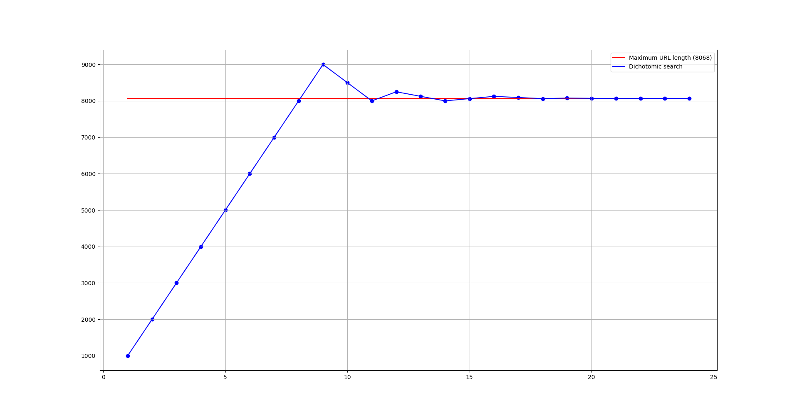

# find-maximum-url-length

## Demonstration

```
[+] Dichotomic search of maximum URL length ...
   [>] Testing URL length 1000, (OK => OK)
   [>] Testing URL length 2000, (OK => OK)
   [>] Testing URL length 3000, (OK => OK)
   [>] Testing URL length 4000, (OK => OK)
   [>] Testing URL length 5000, (OK => OK)
   [>] Testing URL length 6000, (OK => OK)
   [>] Testing URL length 7000, (OK => OK)
   [>] Testing URL length 8000, (OK => OK)
   [>] Testing URL length 9000, (ReadTimeout => OK)
   [>] Testing URL length 8500, (ReadTimeout => ReadTimeout)
   [>] Testing URL length 8000, (OK => ReadTimeout)
   [>] Testing URL length 8250, (ReadTimeout => OK)
   [>] Testing URL length 8125, (ReadTimeout => ReadTimeout)
   [>] Testing URL length 8000, (OK => ReadTimeout)
   [>] Testing URL length 8062, (OK => OK)
   [>] Testing URL length 8124, (ReadTimeout => OK)
   [>] Testing URL length 8093, (ReadTimeout => ReadTimeout)
   [>] Testing URL length 8062, (OK => ReadTimeout)
   [>] Testing URL length 8077, (ReadTimeout => OK)
   [>] Testing URL length 8070, (ReadTimeout => ReadTimeout)
   [>] Testing URL length 8063, (OK => ReadTimeout)
   [>] Testing URL length 8066, (OK => OK)
   [>] Testing URL length 8069, (ReadTimeout => OK)
   [>] Testing URL length 8068, (OK => ReadTimeout)
[+] Found maximum URL length 8068
```


